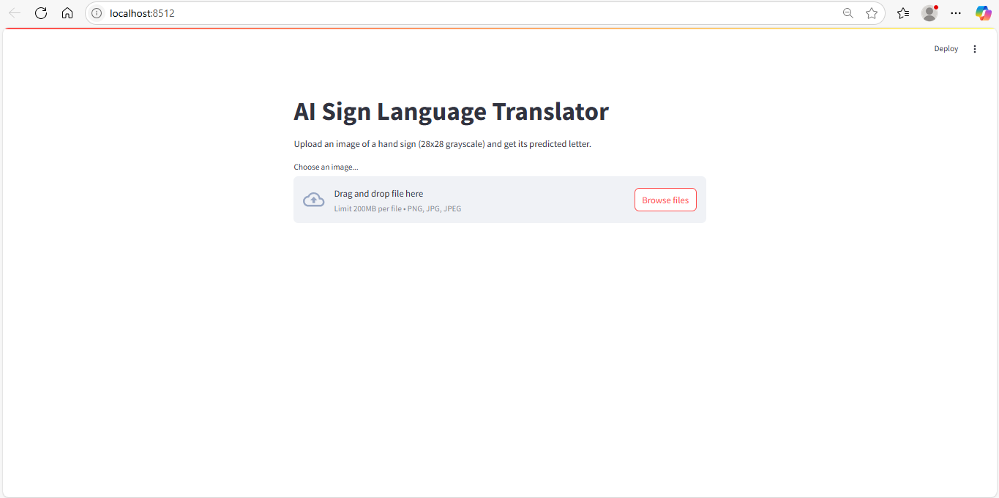
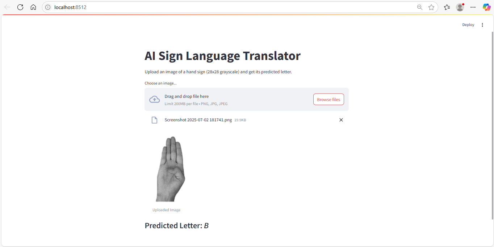
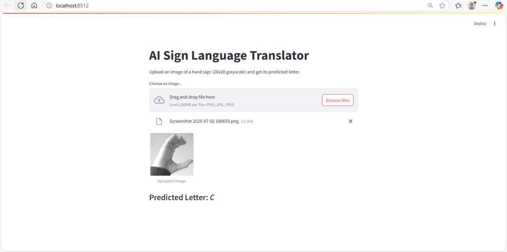
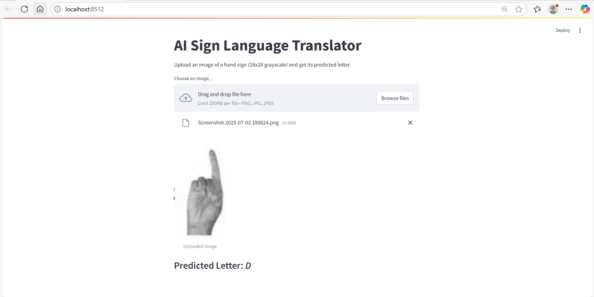

# AI Sign Language Translator
An AI-powered web application that translates hand sign images into English alphabets using a Convolutional Neural Network (CNN). The model is trained on the Sign Language MNIST dataset and deployed via a Streamlit web interface.

Features

- Classifies hand gestures into corresponding English alphabets (A-Y excluding J and Z)
-  Achieves over 92% accuracy
-   Interactive, user-friendly web app built with Streamlit
-   Real-time image upload and prediction

Tech Stack

- Python
- TensorFlow / Keras
- Streamlit
- OpenCV
- NumPy
- PIL (Pillow)

Demo

Dataset
Sign Language MNIST available on Kaggle
https://www.kaggle.com/datamunge/sign-language-mnist

